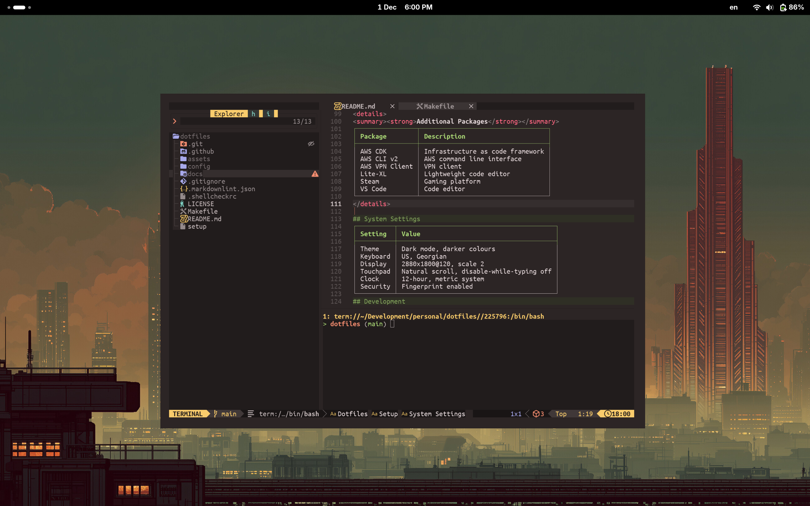

<div align="center">

# Dotfiles

<p align="center">
  
</p>

Personal dotfiles for Fedora, managed with [lnko](https://github.com/pgagnidze/lnko).


</div>

## Quick Start

```bash
git clone https://github.com/pgagnidze/dotfiles.git ~/dotfiles
sudo luarocks install lnko
cd ~/dotfiles/config
lnko link bin bash git ghostty nvim
```

## What's Included

| Config | Description |
|--------|-------------|
| `config/bin` | Scripts symlinked to `~/.local/bin` |
| `config/bash` | Shell configuration with prompt, aliases, and completions |
| `config/claude` | Claude Code settings and custom commands |
| `config/git` | Git configuration with aliases and GPG signing |
| `config/ghostty` | Terminal emulator settings |
| `config/nvim` | Neovim configuration with LazyVim |

### Scripts

| Script | Description |
|--------|-------------|
| `install-fonts` | Download and install Nerd Fonts and Noto symbol fonts |
| `setup-ssh` | Generate ed25519 SSH key and configure for GitHub |

All scripts support `--help` and respect `NO_COLOR` / `FORCE_COLOR` environment variables.

## Setup

<details>
<summary><strong>1. Packages</strong></summary>

Install using your package manager:

```bash
sudo dnf install zoxide fzf fd-find lua luarocks diff-so-fancy gh gtk-murrine-engine gnome-themes-extra
```

Install [Neovim nightly](https://neovim.io/doc/install/).

Install [Ghostty](https://ghostty.org/) terminal.

Install fonts:

```bash
install-fonts
```

</details>

<details>
<summary><strong>2. Node</strong></summary>

```bash
curl -o- https://raw.githubusercontent.com/nvm-sh/nvm/v0.40.1/install.sh | bash
source ~/.bashrc
nvm install 22
npm install -g typescript ts-node prettier eslint @anthropic-ai/claude-code @owloops/claude-powerline markdownlint-cli
```

</details>

<details>
<summary><strong>3. SSH Key</strong></summary>

```bash
setup-ssh your_email@example.com
```

Add the public key to [GitHub SSH keys](https://github.com/settings/keys).

</details>

<details>
<summary><strong>4. GPG Key</strong></summary>

```bash
gpg --full-generate-key
gpg --list-secret-keys --keyid-format=long
```

Copy your key ID (hex string after `rsa4096/`), update `config/git/.gitconfig`:

```ini
[user]
    signingkey = YOUR_KEY_ID
```

Export and add to [GitHub GPG keys](https://github.com/settings/keys):

```bash
gpg --armor --export YOUR_KEY_ID
```

</details>

<details>
<summary><strong>Additional Packages</strong></summary>

| Package | Description |
|---------|-------------|
| AWS CDK | Infrastructure as code framework |
| AWS CLI v2 | AWS command line interface |
| AWS VPN Client | VPN client |
| Lite-XL | Lightweight code editor |
| Steam | Gaming platform |
| VS Code | Code editor |

</details>

## System Settings

| Setting | Value |
|---------|-------|
| Theme | [Gruvbox Dark](https://github.com/Fausto-Korpsvart/Gruvbox-GTK-Theme) |
| Icons | [Reversal Brown](https://github.com/yeyushengfan258/Reversal-icon-theme) |
| Extensions | [Clipboard Indicator](https://extensions.gnome.org/extension/779/clipboard-indicator/), [Blur my Shell](https://github.com/aunetx/blur-my-shell) |
| Keyboard | US, KA |
| Display | 2880x1800@120, scale 2 |
| Touchpad | Natural scroll, disable-while-typing off |
| Clock | 12-hour, metric system |
| Security | Fingerprint enabled |

## Style Guides

Reusable style guides for different languages. Link them to your projects using lnko.

Assumes dotfiles is cloned to `~/dotfiles` as shown in [Quick Start](#quick-start):

```bash
# Link Lua style guide to a project
lnko link -d $HOME/dotfiles/docs -t $HOME/project/docs lua

# Link multiple guides
lnko link -d $HOME/dotfiles/docs -t $HOME/project/docs bash python
```

Add symlinked files to `.gitignore` in each project:

```gitignore
docs/LUA.style.md
```

| Guide | Description |
|-------|-------------|
| [lua](docs/lua/LUA.style.md) | Lua coding conventions |
| [python](docs/python/PYTHON.style.md) | Python coding conventions |
| [bash](docs/bash/BASH.style.md) | Shell scripting conventions |

## Development

```bash
make install    # Install shellcheck and shfmt
make lint       # Run shellcheck on bin scripts
make format     # Format bin scripts with shfmt
```

See [docs/bash/BASH.style.md](docs/bash/BASH.style.md) for shell scripting conventions.

## License

[MIT](LICENSE)
